# php_certchk

## Description

PHP script to show certificate chain from connection.

Supports the following protocols:

- http
- ldap
- ftp
- smtp
- imap
- pop3
- mysql
- postgresql
- rsyslog

It supports Server Name Indication (***sni***) and both Implicit and Explicit (***starttls***) connections.

SNI allows the client to specify the Virtual Host required when the server hosts multiple configurations. This means that each virtual host configured in Apache can have its own certificate. Most web browsers have this enabled by default.

Implicit connections are implied by the port. That is, the server application has a separate, dedicated listen port for SSL. For example, port 443 for https.

Explicit connections connect to the standard non-secured port and explicitly request to change to a secured connection using a START TLS type of command. The command is different for each protocol.


## Usage


> Note that all these examples expose the complete git repository. It is not designed to be internet facing.

1. Simply copy the index.php to an existing PHP capable web server. It requires the ***php-openssl*** package.

```
cd /var/www/html
git clone https://github.com/naebrae/php_certchk.git certchk
```
```
curl http://localhost/certchk
```

2. Docker or Podman

> Note: this example doesn't release the terminal. Add -dt to the run command to detach the terminal and run in the background.
> This maps the local folder in to the docker container so that the file can be edited with out having to rebuild or restart the container.

```
git clone https://github.com/naebrae/php_certchk.git certchk
cd certchk
podman build -t certchk .
podman run -p 1080:80 -p 1443:443 -v .:/var/www/html localhost/certchk
```
```
curl http://localhost:1080
```

3. Docker-compose

> Note: this example doesn't release the terminal. Add -d to the up command to detach the terminal and run in the background.
> This maps the local folder in to the docker container so that the file can be edited with out having to rebuild or restart the container.

```
git clone https://github.com/naebrae/php_certchk.git certchk
cd certchk
sudo docker-compose build
sudo docker-compose up
```
```
curl http://localhost:1080
```

## Screenshots

These show connections to the crtsrv01 example machine from https://github.com/naebrae/ansible_certslab


### 1. Basic http connection

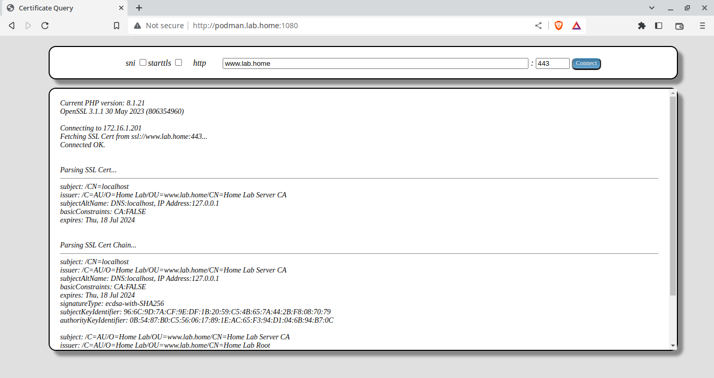

### 2. Connection to crt1.lab.home <ins>without 'sni'</ins> enabled returns default www certificate.


### 3. Connection to crt1.lab.home <ins>with 'sni'</ins> enabled returns crt1.lab.home certificate.

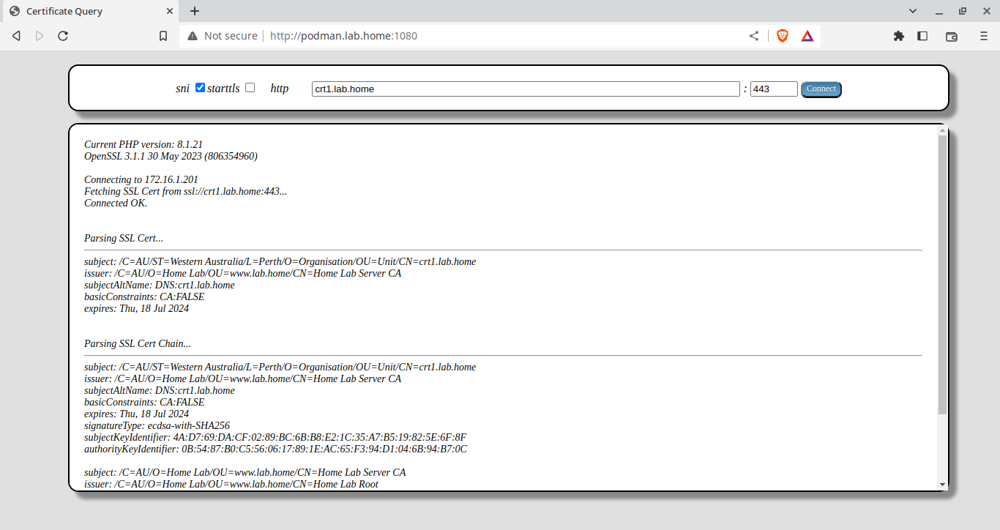

### 4. Basic http connections to non-standard port. In this example, the port tomcat is listening on.


### 5. Implicit LDAP connection to standard SSL port (389ds).


### 6. Explicit (starttls) LDAP connection to non-standard non-secure port (openldap).

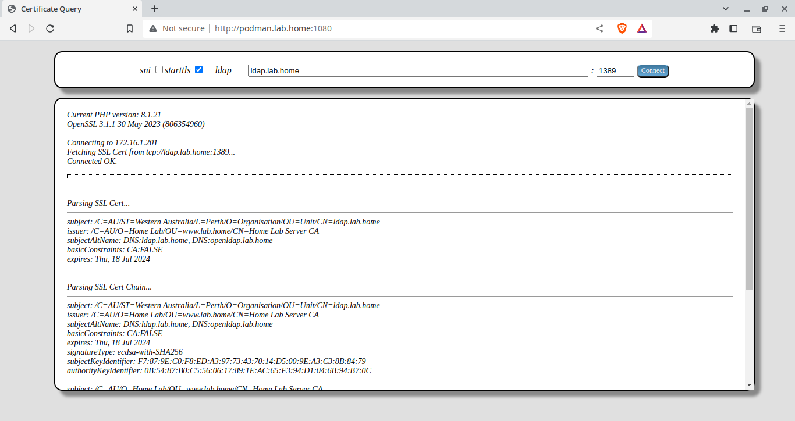

### 7. Explicit (starttls) FTP connection to standard non-secure port.

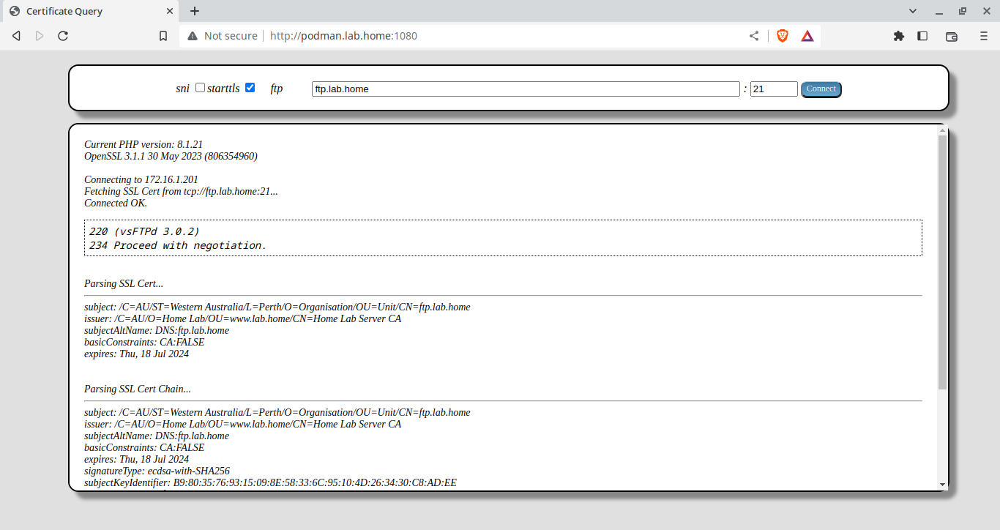

### 8. Implicit SMTP connection to standard SSL port.

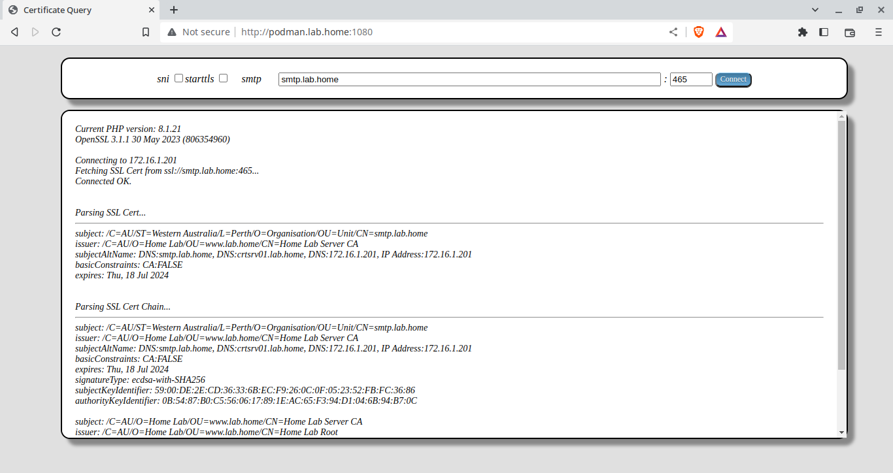

### 9. Explicit (starttls) SMTP connection to standard non-secure port.

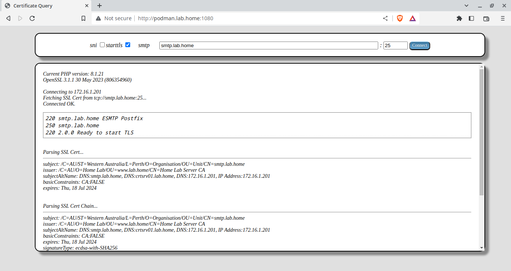

### 10. Explicit (starttls) IMAP connection to standard non-secure port.

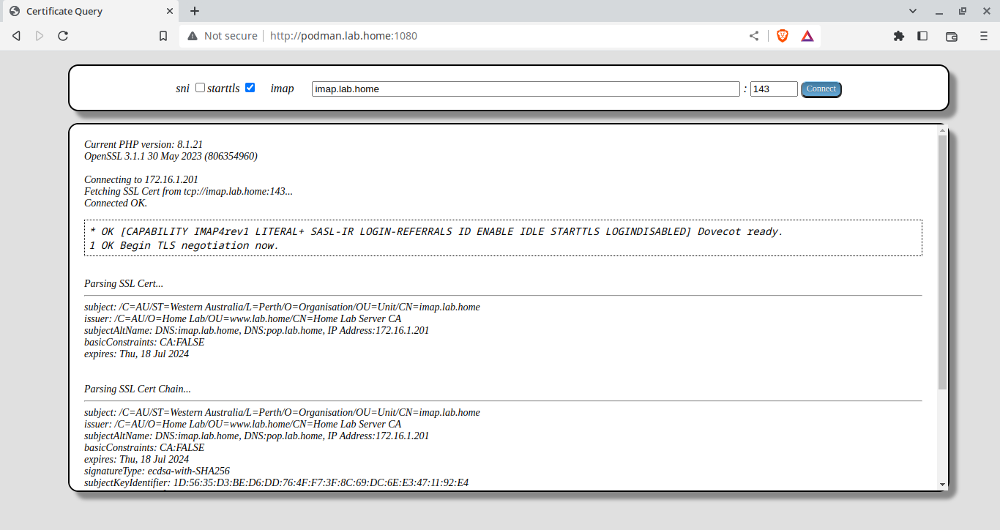

### 11. Implicit IMAP connection to standard SSL port.

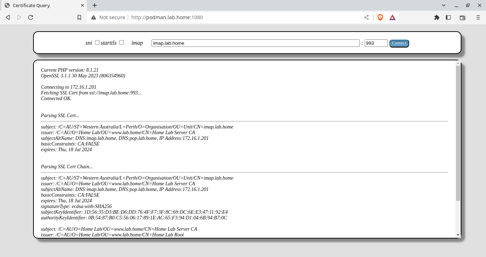

### 12. Explicit (starttls) POP3 connection to standard non-secure port.

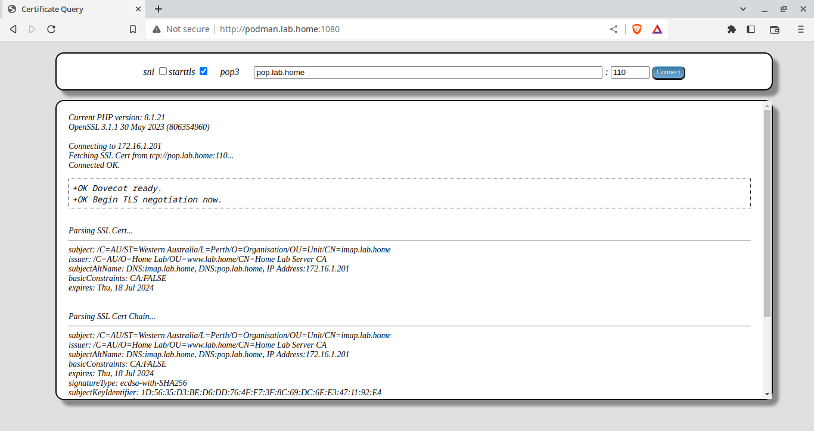

### 13. Implicit POP3 connection to standard SSL port.


### 14. Explicit (starttls) MYSQL connection to standard non-secure port.

> MySQL only supports explicit connection so starttls can not be unselected.


### 15. Explicit (starttls) PGSQL connection to standard non-secure port.

> PostgreSQL only supports explicit connection so starttls can not be unselected.

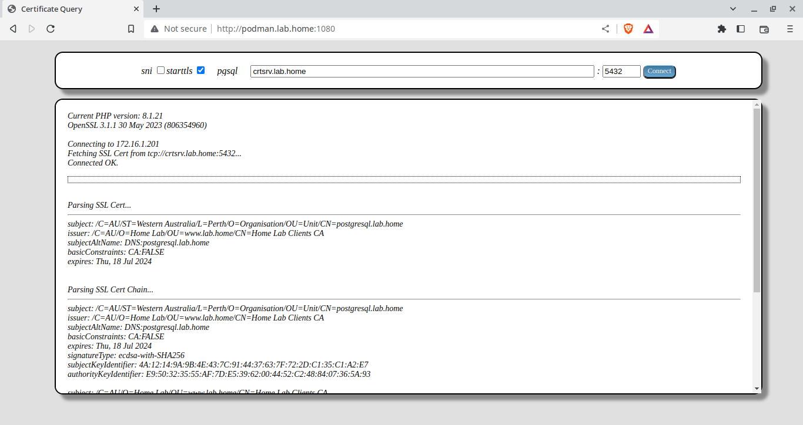

### 16. Implicit Rsyslog connection to standard SSL port.

> Rsyslog only supports implicit connections so starttls can not be selected.

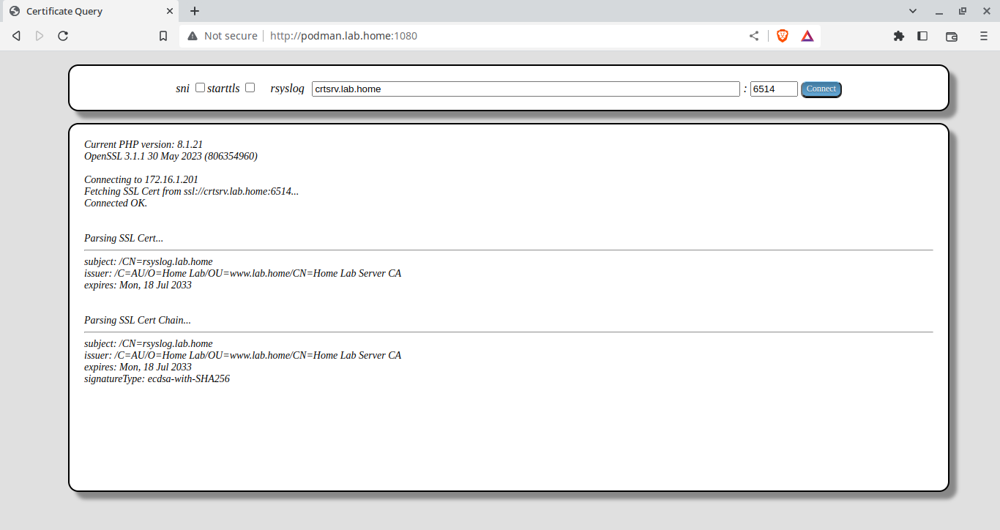

